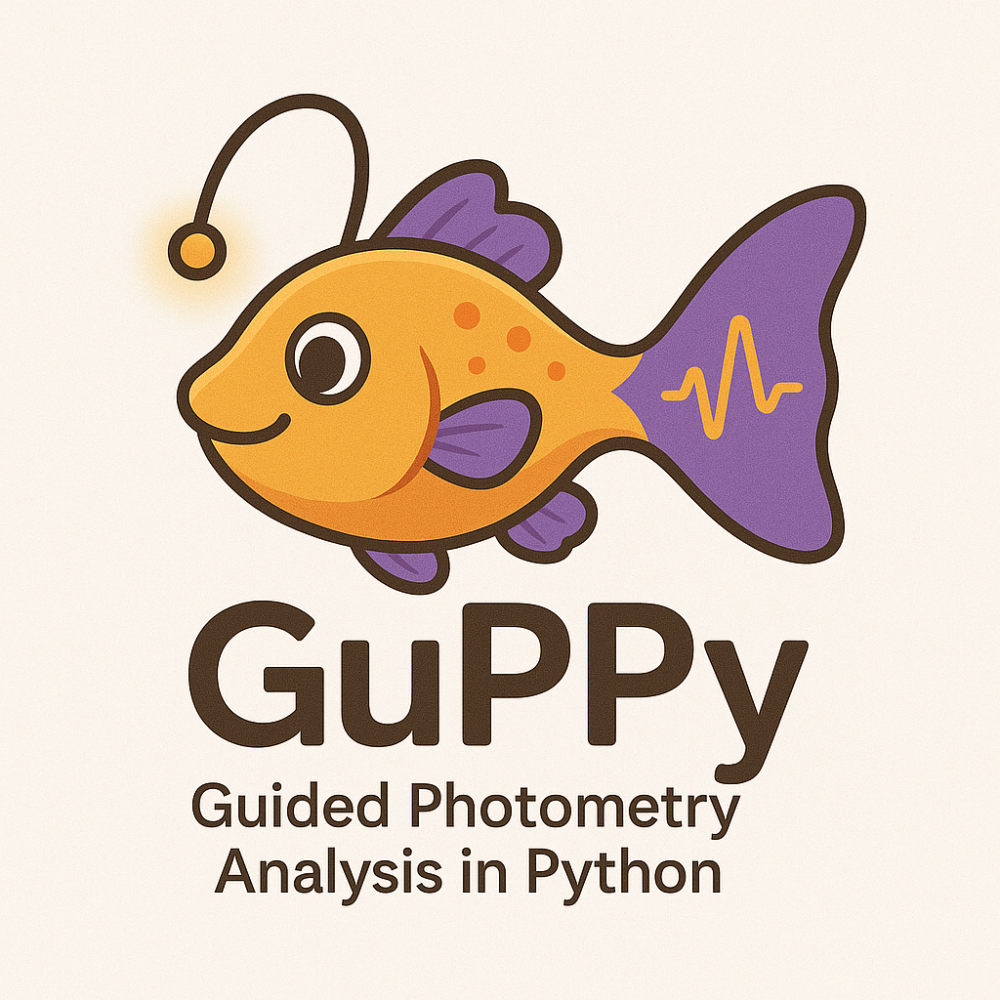

[](https://zenodo.org/badge/latestdoi/382176345) [](https://gitter.im/LernerLab/GuPPy?utm_source=badge&utm_medium=badge&utm_campaign=pr-badge&utm_content=badge) [](https://codecov.io/gh/LernerLab/GuPPy)




## Installation

GuPPy can be run on Windows, Mac or Linux. It requires **Python 3.10 or greater**.

### Step 1: Install Conda

We recommend installing GuPPy inside a conda virtual environment to avoid conflicts with other Python packages on your system.

1. Download the **Miniconda** installer for your operating system from the [official Miniconda page](https://docs.conda.io/en/latest/miniconda.html).
   - **Windows**: Download the `.exe` installer and run it, following the on-screen prompts.
   - **macOS**: Download the `.pkg` installer (or the `.sh` script) and follow the on-screen prompts. Alternatively, run the shell script in a terminal:
     ```bash
     bash Miniconda3-latest-MacOSX-x86_64.sh
     ```
   - **Linux**: Download the `.sh` installer and run it in a terminal:
     ```bash
     bash Miniconda3-latest-Linux-x86_64.sh
     ```

2. After installation, open a new terminal (or Command Prompt / Anaconda Prompt on Windows) and verify conda is available:
   ```bash
   conda --version
   ```

### Step 2: Create and Activate a Conda Environment

1. Create a new conda environment named `guppy_env` with Python 3.12:
   ```bash
   conda create -n guppy_env python=3.12
   ```

2. Activate the environment:
   ```bash
   conda activate guppy_env
   ```
   Your terminal prompt should now show `(guppy_env)` to indicate the environment is active. You will need to activate this environment each time you open a new terminal before using GuPPy.

### Step 3: Install GuPPy

With the `guppy_env` environment active, install GuPPy using one of the two methods below.

#### Option A: Install via PyPI (Recommended)

Install the latest stable release directly from PyPI:

```bash
pip install guppy-neuro
```

#### Option B: Install from GitHub (Latest Development Version)

This option gives you access to the latest features and bug fixes that may not yet be in the stable release.
You will need `git` installed ([installation instructions](https://github.com/git-guides/install-git)).

1. Clone the repository:
   ```bash
   git clone https://github.com/LernerLab/GuPPy.git
   ```

2. Navigate into the cloned directory:
   ```bash
   cd GuPPy
   ```

3. Install the package in [editable mode](https://pip.pypa.io/en/stable/cli/pip_install/#editable-installs):
   ```bash
   pip install -e .
   ```

## Usage

In a terminal or command prompt, you can start using GuPPy by running the following command:

```bash
guppy
```

This will launch the GuPPy user interface, where you can begin analyzing your fiber photometry data.

## Documentation

> **Note:** The Wiki and video tutorials below refer to GuPPy v1.3.0 and earlier. Updated documentation for v2.0 is coming soon.

### Wiki
- The full instructions along with detailed descriptions of each step to run the GuPPy tool is on [Github Wiki Page](https://github.com/LernerLab/GuPPy/wiki).

### Tutorial Videos

- [Installation steps](https://youtu.be/7qfU8xvj2nc)
- [Explaining Input Parameters GUI](https://youtu.be/aO7_QqbYZ84)
- [Individual Analysis steps](https://youtu.be/6IollIr9q6Y)
- [Artifacts Removal](https://youtu.be/KXh3vkkZxuo)
- [Group Analysis steps](https://youtu.be/lntf-SER_so)
- [Use of csv file as an input](https://youtu.be/Yrhartn5Hwk)
- [Use of Neurophotometrics data as an input](https://youtu.be/n1HSGRnBYPQ)

## Sample Data

- [Sample data](https://drive.google.com/drive/folders/1qO8ynfqRoEpWuJ0P1tYVHtLljJXoxufl?usp=sharing) for the user to go through the tool in the start. This folder of sample data has two types of sample data recorded with a TDT system : 1) Clean Data 2) Data with artifacts (to practice removing them) 3) Neurophotometrics data 4) Doric system data. Finally, it has a control channel, signal channel and event timestamps file in a 'csv' format to get an idea of how to structure other data in the 'csv' file format accepted by GuPPy.

## Discussions

- GuPPy was initially developed keeping our data (FP data recorded using TDT systems) in mind. GuPPy now supports data collected using Neurophotometrics, Doric system and also other data types/formats using 'csv' files as input, but these are less extensively tested because of lack of sample data. If you have any issues, please get in touch on the [chat room](https://gitter.im/LernerLab/GuPPy?utm_source=share-link&utm_medium=link&utm_campaign=share-link) or by [raising an issue](https://github.com/LernerLab/GuPPy/issues), so that we can continue to improve this tool.

## Citation

- If you use GuPPy for your research, please cite [Venus N. Sherathiya, Michael D. Schaid, Jillian L. Seiler, Gabriela C. Lopez, and Talia N. Lerner GuPPy, a Python toolbox for the analysis of fiber photometry data](https://www.nature.com/articles/s41598-021-03626-9)

> Venus N. Sherathiya, Michael D. Schaid, Jillian L. Seiler, Gabriela C. Lopez, and Talia N. Lerner GuPPy, a Python toolbox for the analysis of fiber photometry data. Sci Rep 11, 24212 (2021). https://doi.org/10.1038/s41598-021-03626-9

## Contributors

- [Venus Sherathiya](https://github.com/venus-sherathiya)
- [Michael Schaid](https://github.com/Mschaid)
- Jillian Seiler
- [Gabriela Lopez](https://github.com/glopez924)
- [Talia Lerner](https://github.com/talialerner)
- [Paul Adkisson-Floro](https://github.com/pauladkisson)
