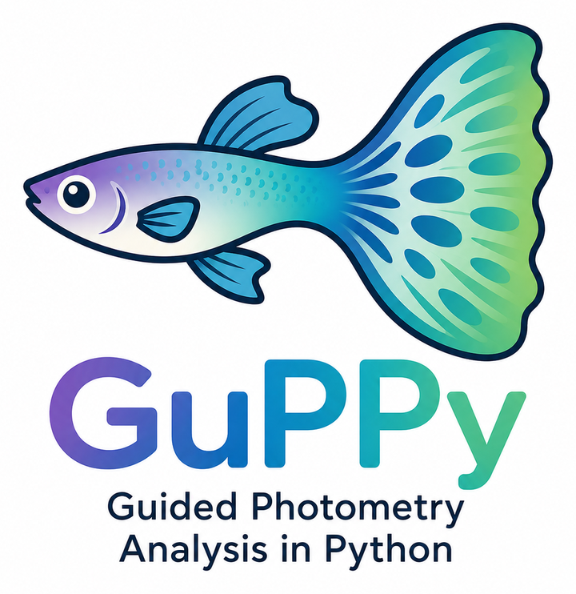

[](https://zenodo.org/badge/latestdoi/382176345) [](https://gitter.im/LernerLab/GuPPy?utm_source=badge&utm_medium=badge&utm_campaign=pr-badge&utm_content=badge) [](https://codecov.io/gh/LernerLab/GuPPy) [](https://guppy.readthedocs.io/)



Guided Photometry Analysis in Python, a free and open-source fiber photometry data analysis tool.

## Quick start

Requires Python 3.10 or greater. We recommend installing into a conda environment:

```bash
conda create -n guppy_env python=3.12
conda activate guppy_env
pip install guppy-neuro
```

Then launch the user interface:

```bash
guppy
```

See the [installation guide](https://guppy.readthedocs.io/en/latest/installation.html) for the full walkthrough, including installing conda and installing from source.

## Documentation

The GuPPy documentation lives at [guppy.readthedocs.io](https://guppy.readthedocs.io/): a [tutorial](https://guppy.readthedocs.io/en/latest/tutorials/index.html) walking through a first analysis end to end, [how-to guides](https://guppy.readthedocs.io/en/latest/how-to/index.html) for individual tasks, [explanations](https://guppy.readthedocs.io/en/latest/explanation/index.html) of how the analysis works, and a [reference](https://guppy.readthedocs.io/en/latest/reference/index.html) for every input parameter and output file.

## Citation

- If you use GuPPy for your research, please cite [Venus N. Sherathiya, Michael D. Schaid, Jillian L. Seiler, Gabriela C. Lopez, and Talia N. Lerner GuPPy, a Python toolbox for the analysis of fiber photometry data](https://www.nature.com/articles/s41598-021-03626-9)

> Venus N. Sherathiya, Michael D. Schaid, Jillian L. Seiler, Gabriela C. Lopez, and Talia N. Lerner GuPPy, a Python toolbox for the analysis of fiber photometry data. Sci Rep 11, 24212 (2021). https://doi.org/10.1038/s41598-021-03626-9

## Contributors

- [Venus Sherathiya](https://github.com/venus-sherathiya)
- [Michael Schaid](https://github.com/Mschaid)
- Jillian Seiler
- [Gabriela Lopez](https://github.com/glopez924)
- [Talia Lerner](https://github.com/talialerner)
- [Paul Adkisson-Floro](https://github.com/pauladkisson)
