```mermaid
flowchart LR
    RAW(["Raw files<br/>TDT · Doric · NPM · CSV"])

    S2["saveStoresList.py<br/><i>Step 2</i>"]
    F1(["storesList.csv"])

    S3["readTevTsq.py<br/><i>Step 3</i>"]
    F2(["&lt;storename&gt;.hdf5"])

    S4["preprocess.py<br/><i>Step 4</i>"]
    F3(["z_score / dff .hdf5"])

    S5["computePsth.py<br/>computeCorr.py<br/>findTransientsFreqAndAmp.py<br/><i>Step 5</i>"]
    F4(["psth .hdf5 / .pkl<br/>peakArea .csv"])

    S6["visualizePlot.py<br/><i>Step 6</i>"]
    DASH(["plots"])

    RAW --> S2 --> F1 --> S3 --> F2 --> S4 --> F3 --> S5 --> F4 --> S6 --> DASH

    classDef step fill:#d5f5e3,stroke:#1e8449,color:#000
    classDef file fill:#fef9e7,stroke:#b7950b,color:#000
    class S2,S3,S4,S5,S6 step
    class RAW,F1,F2,F3,F4,DASH file
```

```mermaid
%%{init: {'theme': 'base', 'themeVariables': {'fontSize': '18px'}}}%%
flowchart LR
    RAW(["Raw files<br/>TDT · Doric · NPM · CSV"])

    S2["storenames.py<br/><i>Step 2</i>"]
    F1(["storesList.csv"])

    S3["read_raw_data.py<br/><i>Step 3</i>"]
    EX["TDT · Doric · NPM · CSV<br/>extractors"]
    F2(["&lt;storename&gt;.hdf5"])

    S4["preprocess.py<br/><i>Step 4</i>"]
    A4["timestamp_correction<br/>z_score · artifact_removal"]
    V4["visualization.preprocessing"]
    F3(["z_score / dff .hdf5"])

    S5["psth.py · transients.py<br/><i>Step 5</i>"]
    A5["compute_psth · psth_peak_and_area<br/>cross_correlation · transients"]
    V5["visualization.transients"]
    F4(["psth .hdf5 / .pkl<br/>peakArea .csv"])

    S6["visualize.py<br/><i>Step 6</i>"]
    DASH(["Panel dashboard"])

    RAW --> S2 --> F1 --> S3 --> F2 --> S4 --> F3 --> S5 --> F4 --> S6 --> DASH
    S2 -. calls .-> EX
    S3 -. calls .-> EX
    S4 -. calls .-> A4
    S4 -. calls .-> V4
    S5 -. calls .-> A5
    S5 -. calls .-> V5

    classDef orch fill:#d5f5e3,stroke:#1e8449,color:#000
    classDef ext fill:#d6eaf8,stroke:#2980b9,color:#000
    classDef anal fill:#e8daef,stroke:#7d3c98,color:#000
    classDef viz fill:#fef0e6,stroke:#ca6f1e,color:#000
    classDef file fill:#fef9e7,stroke:#b7950b,color:#000
    class S2,S3,S4,S5,S6 orch
    class EX ext
    class A4,A5 anal
    class V4,V5 viz
    class RAW,F1,F2,F3,F4,DASH file
```

# GuPPy Architecture Overview

This document shows what changed in the v2 refactor: how the code is now organized, and how the
same analysis pipeline is handled by cleaner, better-separated modules.

---

## Code Organization

### Before (v1)

```text
GuPPy/
├── saveStoresList.py          ← Step 2: store mapping + format detection
├── readTevTsq.py              ← Step 3: reads raw data from all acquisition formats
├── preprocess.py              ← timestamp correction, z-score, artifact removal
├── computePsth.py             ← PSTH computation, peak/area metrics, group averages
├── computeCorr.py             ← cross-correlation
├── findTransientsFreqAndAmp.py ← transient detection
├── combineDataFn.py           ← combine multi-file recordings
└── visualizePlot.py           ← plotting and visualization
```

### After (v2)

```text
src/guppy/
├── extractors/                ← reads raw acquisition data from all supported formats
│   ├── base_recording_extractor.py   (abstract interface)
│   ├── tdt_recording_extractor.py
│   ├── doric_recording_extractor.py
│   ├── csv_recording_extractor.py
│   ├── npm_recording_extractor.py
│   └── detect_acquisition_formats.py
│
├── orchestration/             ← coordinates each pipeline step, bridging the UI and signal processing backend
│   ├── save_parameters.py     (Step 1)
│   ├── storenames.py          (Step 2)
│   ├── read_raw_data.py       (Step 3)
│   ├── preprocess.py          (Step 4)
│   ├── psth.py                (Step 5)
│   ├── transients.py          (Step 5)
│   └── visualize.py           (Step 6)
│
├── analysis/                  ← individual signal processing algorithms (z-scoring, artifact removal, PSTH, etc.)
│   ├── timestamp_correction.py
│   ├── z_score.py
│   ├── control_channel.py
│   ├── artifact_removal.py
│   ├── combine_data.py
│   ├── compute_psth.py
│   ├── psth_peak_and_area.py
│   ├── cross_correlation.py
│   ├── psth_average.py
│   ├── transients.py
│   ├── transients_average.py
│   ├── standard_io.py
│   └── io_utils.py
│
├── frontend/                  ← Panel UI components (parameter forms, store selectors, visualization dashboard)
│   ├── input_parameters.py
│   ├── storenames_selector.py
│   ├── storenames_config.py
│   ├── artifact_removal.py
│   ├── visualization_dashboard.py
│   ├── parameterized_plotter.py
│   ├── sidebar.py
│   └── progress.py
│
├── visualization/             ← matplotlib plotting functions for signals and transients
│   ├── preprocessing.py
│   └── transients.py
│
└── testing/                   ← headless API for scripted use and testing
    ├── api.py
    ├── consistency.py
    └── mock_recording_extractor.py
```

---

## Data Flow Through the Pipeline

The pipeline is the same in both versions — raw acquisition files go in, analysis results come out.
What changed is which code handles each step.

### Before (v1)



### After (v2)



