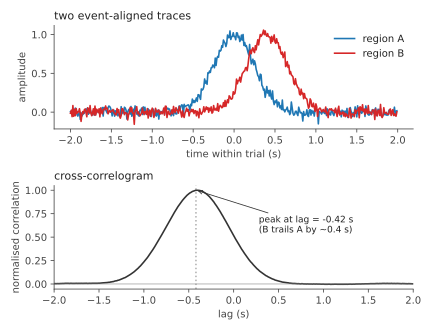
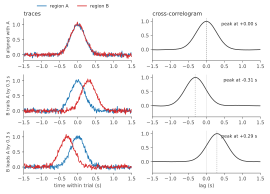
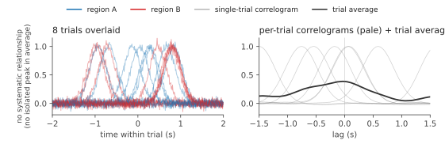

# Cross-correlation

## Background

In experiments that record from two brain regions or two cell populations simultaneously, a natural follow-up to computing each region's PSTH is: *do these two signals move together around the event?* And if they do, *does one lead the other?*

The first half is answered by an ordinary correlation between the two traces. The second half is not. An ordinary correlation compares region A at time `t` with region B at the same time `t`, so a consistent 200 ms offset between them simply registers as a weaker correlation, with no information about which region led. Two regions tightly coupled with a 200 ms lag can look much less correlated than they actually are, and you cannot tell from the result whether A preceded B or the reverse.

Cross-correlation recovers the missing direction by reporting how well the two signals align at *every* possible time offset, not just zero. In fiber photometry it is typically used to compare two subregions of the same structure (for example DMS vs DLS in striatum) or two simultaneous sensors (a dopamine and an acetylcholine sensor) and ask which one consistently leads.

Formally, cross-correlation is a similarity-versus-lag curve. Given two time series `x(t)` and `y(t)`, you slide one across the other and at each offset `tau` compute their inner product. The resulting curve, written `R_xy(tau)`, encodes two distinct pieces of information:

- **Where the peak sits.** A peak at `tau = 0` means the two signals covary instantaneously. A peak at `tau = -200 ms` means `x` leads `y` by 200 ms. Reading the lag at which the peak occurs is how you decide whether one region's activity precedes another.
- **How sharp and tall the peak is.** A narrow, tall peak says the alignment is precise and consistent. A broad, low peak says the two signals share slow drift but not fast structure. A flat curve says no systematic relationship survived the integration window.

## How GuPPy uses it

GuPPy asks the event-locked version of this question. Rather than cross-correlating the full continuous z-scored trace, GuPPy cross-correlates the **per-trial PSTH window** of two signal regions, both already aligned to the same event timestamp. The result is "do these regions co-fluctuate around the behavioural event?" rather than "are these regions coupled in general?". For event-driven analyses these are different questions, because long-timescale baseline coupling between two photometry channels is often dominated by shared physiological drift (movement, photobleaching, breathing artefacts) and is usually not the thing you are trying to measure. Restricting to the event window suppresses that contribution. The trade-off is that anything happening outside the PSTH window is invisible; if you need to characterise long-range or oscillatory coupling beyond the event, you have to step outside GuPPy and compute the cross-correlation yourself on the continuous z-scored trace.

The procedure for each event is:

1. For each trial in the PSTH, take the trace from region A and the trace from region B over the same event-aligned window.
2. Compute the full cross-correlation of the two windowed traces with `scipy.signal.correlate`.
3. Normalise the resulting curve by dividing it by its own peak absolute value, so the maximum becomes `±1`.
4. Repeat across trials and stack the per-trial curves into a 2D array, with a final row holding the lag axis (in seconds, derived from `signal.correlation_lags(...) / sample_rate`).

The output is therefore a stack of normalised per-trial cross-correlograms, one row per trial, plus a row of lag values shared across the stack. This stack is what later gets visualised and what gets averaged across sessions in group analysis.

Cross-correlation is not its own pipeline step. It runs as a sub-stage of Step 5 (PSTH Computation), opt-in via the `computeCorr` parameter in the Input Parameters GUI, executed automatically after each event's PSTH is written. The output is a terminal product: it is read by the Visualization GUI for plotting and optionally by group analysis for cross-session averaging, but nothing else in the pipeline depends on it.

## Reading the correlogram

After the PSTH step writes per-trial cross-correlation curves into `<session>/cross_correlation_output/`, the Visualization GUI loads them and presents one cross-correlogram per `(event, signal-type, region-pair)` triple. The plot's x-axis is lag in seconds, the y-axis is normalised correlation, and the curve drawn on it is either the mean across trials or a single selected trial depending on the visualization mode. Everything below describes how to read **that plot**. The on-disk HDF5 layout that backs it is documented separately in the reference page.

### Lag axis

The lag runs from `-W` to `+W` where `W` is the PSTH window length. GuPPy computes the cross-correlation by calling `scipy.signal.correlate` directly (`src/guppy/analysis/cross_correlation.py:13-15`), so its sign convention applies here: a positive lag means the second region trails the first. The pair ordering in the output file name tells you which region is which: in a file named `corr_<event>_<type>_<regionA>_<regionB>.h5`, a peak at `+50 ms` means `regionB` trails `regionA` by 50 ms on that trial, so `regionA` leads.

### Peak height

Every trial is normalised independently to its own peak, so the maximum of any per-trial correlogram is `±1` by construction. Peak height is therefore not comparable across trials: two trials with completely different underlying coupling magnitudes will both end up at peak = 1 after normalisation. The figure below makes this concrete. Three trials with the same lag relationship but very different absolute amplitudes (both regions large, both regions tiny, asymmetric) produce visually indistinguishable normalised correlograms. The unnormalised inner product is computed inside `compute_cross_correlation` but is not persisted; only the normalised curves go to disk, so absolute coupling magnitude cannot be recovered from the saved output.

### Peak spread (timing consistency)

It helps to be explicit about two related quantities at this point. A **single-trial correlogram** is the cross-correlogram computed from one trial's pair of traces. A **trial average** is the simple mean across trials of those single-trial correlograms, lag by lag. The Visualization GUI plots the trial average, but it is computed from the stack of single-trial correlograms saved in `cross_correlation_output/`. In the figures below, single-trial correlograms appear as the pale gray curves and the trial average is the bold dark line.

The width of the trial-averaged correlogram peak is mostly telling you about *timing consistency across trials*, not about the shape of any single trial's correlogram. If every trial has the same lead/lag, the per-trial peaks all stack at the same lag and the trial average peak is narrow and tall. If the lead/lag varies trial-to-trial, the per-trial peaks spread across lag values and the average smears into a broad peak with proportionally lower height. Each individual trial is normalised to `±1` by the per-trial peak normalisation, but misaligned peaks average to less than 1.

A separate factor that affects peak width is signal bandwidth: the cross-correlogram inherits the broader of the two signal widths, so cross-correlating a sharp transient in one region with a slow drift in another produces a broad peak even when timing is perfectly locked, because the slow signal cannot resolve fast structure.

### Across trials

The trial average is a useful summary, but it can hide structure that a per-trial view would expose. The most striking case is **bimodality**: when half the trials peak at one lag and the other half peak at a different lag, the average can blend the two clusters into a single broad peak that looks indistinguishable from "trials with uniformly jittered timing", but reflects neither population of trials honestly.

The figure below shows two scenarios whose trial averages look broadly similar but whose underlying per-trial peak distributions are very different. Top row: trials with peak lag uniformly jittered across a moderate range. Bottom row: trials whose peak lag is either +0.2 s or -0.2 s, with nothing in between. Both averages are broad single-peaked curves; only the per-trial peak-lag histograms (right column) reveal that the two scenarios are unrelated.

The Visualization GUI plots only the trial average. To compute the histogram for your own data, load the per-trial correlograms from the on-disk HDF5 in `<session>/cross_correlation_output/` and take `np.argmax` of each row to get the per-trial peak lag, then bin those values.

### No isolated peak (no systematic relationship)

Two regions can each have visible event-locked structure on a trial-by-trial basis without their structure tracking each other. If the timing of A's response and the timing of B's response are independent across trials, every per-trial correlogram still has a peak (per-trial normalisation forces one), but the peak location is different on each trial. The trial average is no longer dominated by any single lag, so it has no isolated peak rising clearly above the baseline. The meaningful signature of "no systematic relationship" is this absence of a localised peak in the average, not a perfectly flat curve.

## Limitations and alternatives

Two cautions before reading too much into a peak. First, a leading peak does not imply causation: both regions could be driven by a common upstream input, and apparent leads can come from indicator kinetics or filter delays rather than from neural timing, with the additional caveat that the lead/lag you see is conditional on the alignment event and window length you chose. Second, the result is sensitive to the PSTH window itself: too short a window squeezes the lag range so that real lags hit the edge, while too long a window lets the longest-timescale fluctuation in the window dominate the normalisation and broadens the peak in ways that have nothing to do with the timing relationship of interest.

Cross-correlation is also one of several tools for studying how two simultaneously recorded channels relate. A Pearson correlation at zero lag is simpler and gives a single number for instantaneous similarity; it is often used as a quick check before reaching for cross-correlation. Coherence is the frequency-domain analog, useful when the coupling is band-specific (for instance, theta-band coordination across regions). Granger causality tests whether one signal helps predict the other beyond its own past, hinting at directional influence, but in fiber photometry it has well-known confounds from indicator kinetics and slow drift. None of these are computed by GuPPy. Cross-correlation is the standard tool when the question is "does one signal lead the other around this event," and is best read as one piece of evidence in a larger argument rather than a self-contained answer.
