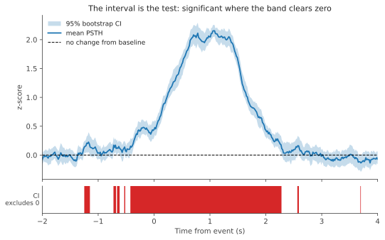

# PSTH significance

## The question

A [PSTH](psth.md) with an SEM band invites a judgement call: the trace goes up after the event, the band does not quite touch zero, and you have to decide by eye whether that counts. Two PSTHs plotted together are worse — overlapping bands are not a test, and how much they overlap depends on how many trials you happened to collect.

PSTH significance answers the question the eye is trying to answer, for every timepoint in the window:

- **Is this event's response different from baseline?** Computed for every event automatically.
- **Is the response to event A different from the response to event B?** Computed for the event pairs you name.

The output is not a single p-value for the whole window. It is a mask over the time axis saying which stretches are significant, which is what you want when the interesting question is usually *when* the response begins and how long it lasts.

## The interval is the test

A 95% confidence interval and a two-sided test at α = 0.05 are the same statement. If a 95% interval on some quantity excludes zero, you would reject "that quantity is zero" at p < 0.05. So instead of computing a test statistic and a p-value, GuPPy computes an interval at each timepoint and asks whether zero is inside it.

The quantity being bounded is the mean across trials at that timepoint, or — for a comparison between two events — the difference between the two means. So the two-sample test is not a different test; it is the same one applied to the difference.

## Why the interval is bootstrapped

You could get an interval at each timepoint from `mean ± 1.96 × SEM`, using the `err` column GuPPy already stores. That leans on the trial-to-trial distribution being normal, which with 15–30 trials you cannot check and which photometry often violates — trial amplitudes are skewed and heavy-tailed.

The bootstrap estimates the sampling distribution of the mean from the data instead of assuming it:

1. Resample *n* trials with replacement from the *n* real trials.
2. Average them into one synthetic mean waveform.
3. Repeat 1000 times.
4. Take the interval from the spread of those 1000 values at each timepoint.

Whole trials are resampled, so the structure within a trial is preserved. GuPPy uses the **bias-corrected and accelerated (BCa)** interval rather than a plain percentile interval: percentile intervals are slightly too narrow at small sample sizes and are not shaped correctly when the underlying distribution is skewed, and BCa corrects for both.

## Why isolated timepoints are discarded

The interval is computed independently at each timepoint, so it is a *pointwise* band, not a simultaneous one. Across a window of several thousand samples, some will clear zero by chance even when nothing is happening — visible as the scattered marks in the strip above.

GuPPy removes them by requiring **temporal contiguity** rather than by adjusting α. A stretch counts only if it is longer than twice the moving-average filter window set in Step 3. The reasoning is physical rather than statistical: a moving-average filter cannot produce features shorter than its own window, so anything briefer is noise by construction.

This is a heuristic, not a calibrated correction. It does not give a family-wise error rate; it removes the blips that a pointwise band inevitably produces. A short stretch just under the threshold is discarded even if it is real, and that is a deliberate trade.

## What is being resampled

This is the part that most affects whether a result means what you think it means. Photometry data is **nested**: trials sit inside sessions, and sessions sit inside groups.

GuPPy resamples whichever unit the folder you run it in holds:

| Where you run it | What a column is | What is resampled |
|---|---|---|
| A session run folder | one trial | trials |
| A group folder | one session's average | sessions |

This matters because the unit has to match the question. Comparing two events *within one session* is a question about that session, and trials are the right unit. Comparing groups is a question about the population the sessions were drawn from, and there the session is the unit — the trials inside each session have already been averaged away before the comparison happens.

Pooling all the trials from every session in a group and treating them as one big sample is the thing to avoid. It counts *n* as the total number of trials when the real replication is the number of sessions, so the interval comes out far too narrow. In simulation, with no true difference between two groups at all, pooling reports a significant difference **70% of the time** against a nominal 5%.

This is a well-documented failure mode in neuroscience rather than a quirk of this analysis; see [Aarts et al. (2014)](https://www.nature.com/articles/nn.3648), which found nested designs in 53% of the papers it reviewed and Type I error inflated to as much as 80% when the nesting is ignored. [Saravanan, Berman and Sober (2020)](https://nbdt.scholasticahq.com/article/13927-application-of-the-hierarchical-bootstrap-to-multi-level-data-in-neuroscience) reach the same conclusion for bootstrap methods specifically. [McNabb and Murayama (2021)](https://pmc.ncbi.nlm.nih.gov/articles/PMC9559079/) show that averaging within each session first — what GuPPy does — is equivalent to a multilevel model when every session contributes the same number of trials, and remains sound when they do not.

## What the result does not tell you

**Sessions in a group are treated as independent.** If several of them come from the same animal, they are not, and the interval will be too narrow in the same way pooling trials is. GuPPy has no concept of a subject, so it cannot detect this — keeping one session per animal in a group, or reading the result with that caveat in mind, is left to you.

**A significant stretch does not pin down when the response started.** The result says the effect is somewhere in that stretch, not that it begins at its left edge. Reading a precise onset off a cluster boundary is the most common way this kind of analysis is over-interpreted.

**Small samples give unreliable intervals whichever method is used.** Below three trials or sessions the bootstrap cannot run at all and the comparison is skipped. Between three and five it runs but is driven by a handful of distinct resamples; GuPPy logs a warning, and the sample count is recorded in the output so you can judge for yourself.

**Timepoints where too few trials overlap have no interval.** Trials near the start or end of a recording have their PSTH windows padded, and artifact removal blanks stretches of others. Where fewer than three trials remain at a timepoint, no interval can be computed and the timepoint is reported as not significant rather than either way. GuPPy warns when this affects a large fraction of a window, so a mostly-blank result is not mistaken for a confident negative.

## Reading the output

Each comparison is written as its own table, giving the time axis, the estimate, both interval bounds, the significance flag, and the sample count. Keeping the bounds rather than only the flag is deliberate: it lets you see how close a non-significant stretch came, and how wide the interval is where the sample size is small. See [Outputs](../reference/outputs.md) for the file layout, and [Parameters](../reference/parameters.md) for how to name the comparisons you want.
