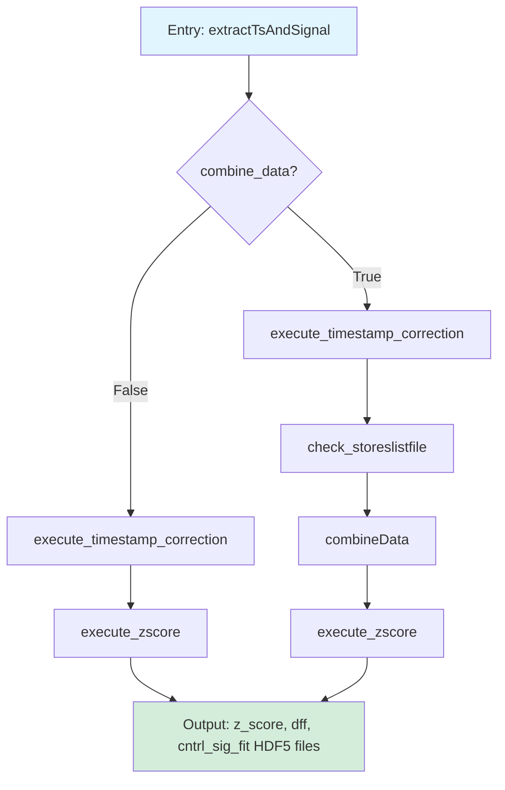
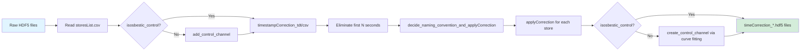
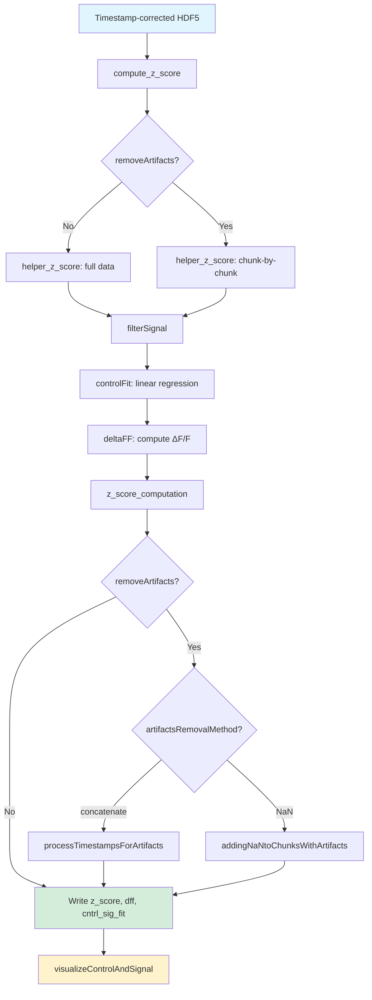
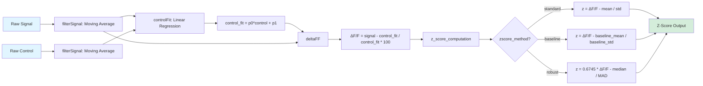

# Step 4 (preprocess.py) Data Flow Analysis

## Overview

Step 4 processes timestamp-corrected photometry data and computes normalized signals (ΔF/F and z-scores). It handles artifact removal, data combination from multiple sessions, and generates quality control visualizations.

## High-Level Data Flow

## Main Processing Paths

### Entry Point
**`extractTsAndSignal(inputParameters)`** (line 1178) is the main entry point called by the GUI or API.

### Path 1: Normal Processing (combine_data = False)
1. `execute_timestamp_correction()` → Correct timestamps and align data
2. `execute_zscore()` → Compute z-scores and ΔF/F

### Path 2: Combined Data Processing (combine_data = True)
1. `execute_timestamp_correction()` → Correct timestamps for each file
2. `check_storeslistfile()` → Merge store lists from multiple files
3. `combineData()` → Combine data from multiple recording sessions
4. `execute_zscore()` → Compute z-scores and ΔF/F on combined data

## Detailed Processing Stages

### Stage 1: Timestamp Correction

#### Function: `execute_timestamp_correction(folderNames, inputParameters)`

**Input:**
- Raw HDF5 files from extractors: `control_*.hdf5`, `signal_*.hdf5`, `event_*.hdf5`

**Process:**
1. For each session folder:
   - Read `storesList.csv` (mapping of raw names to semantic names)
   - If no isosbestic control: `add_control_channel()` creates placeholder control files
   - **`timestampCorrection_tdt()`** or **`timestampCorrection_csv()`**:
     - Eliminates first N seconds (`timeForLightsTurnOn`)
     - For TDT: expands timestamps from block timestamps + sampling rate
     - For CSV: uses timestamps as-is
     - Writes `timeCorrection_*.hdf5` with keys: `timestampNew`, `correctionIndex`, `sampling_rate`
   - **`decide_naming_convention_and_applyCorrection()`**:
     - For each store, calls `applyCorrection()` to crop data using `correctionIndex`
     - For control/signal channels: crops data arrays
     - For event channels: subtracts time offset from timestamps
   - If no isosbestic control: **`create_control_channel()`** generates synthetic control via curve fitting

**Output:**
- Timestamp-corrected HDF5 files with trimmed data
- `timeCorrection_*.hdf5` files containing corrected timestamps

### Stage 2: Z-Score Computation

#### Function: `execute_zscore(folderNames, inputParameters)`

**Input:**
- Timestamp-corrected HDF5 files

**Process:**
1. For each output folder:

   **`compute_z_score(filepath, inputParameters)`**:
   - For each control/signal pair:
     - **`helper_z_score(control, signal, filepath, name, inputParameters)`**:

       **Without artifacts removal:**
       - `execute_controlFit_dff()`: Filter signals → fit control to signal → compute ΔF/F
       - `z_score_computation()`: Compute z-score from ΔF/F

       **With artifacts removal:**
       - For each user-selected chunk (from `coordsForPreProcessing_*.npy`):
         - If no isosbestic: `helper_create_control_channel()` creates synthetic control
         - `execute_controlFit_dff()` on chunk
       - Concatenate or NaN-fill between chunks
       - `z_score_computation()` on processed data

     - Writes: `z_score_*.hdf5`, `dff_*.hdf5`, `cntrl_sig_fit_*.hdf5`

   **If artifacts removal with concatenate method:**
   - **`processTimestampsForArtifacts()`**:
     - `eliminateData()`: Concatenates good chunks, adjusts timestamps to be continuous
     - `eliminateTs()`: Aligns event timestamps with new timeline
     - Overwrites data files with concatenated versions

   **If artifacts removal with NaN method:**
   - **`addingNaNtoChunksWithArtifacts()`**:
     - `addingNaNValues()`: Replaces bad chunks with NaN
     - `removeTTLs()`: Filters event timestamps to keep only valid times

   - **`visualizeControlAndSignal()`**: Plots control, signal, cntrl_sig_fit for QC

**Output:**
- `z_score_*.hdf5` (z-scored signal)
- `dff_*.hdf5` (ΔF/F)
- `cntrl_sig_fit_*.hdf5` (fitted control channel)

## Key Data Transformations

### Signal Processing Pipeline

### Transformation Functions

1. **`filterSignal(filter_window, signal)`** (line 822)
   - Applies moving average filter with configurable window
   - Uses `scipy.signal.filtfilt` for zero-phase filtering

2. **`controlFit(control, signal)`** (line 815)
   - Linear regression: fits control to signal
   - Returns: `fitted_control = p[0] * control + p[1]`

3. **`deltaFF(signal, control)`** (line 804)
   - Formula: `((signal - control) / control) * 100`
   - Computes normalized fluorescence change

4. **`z_score_computation(dff, timestamps, inputParameters)`** (line 853)
   - **Standard z-score:** `(ΔF/F - mean(ΔF/F)) / std(ΔF/F)`
   - **Baseline z-score:** `(ΔF/F - mean(baseline)) / std(baseline)`
   - **Robust z-score:** `0.6745 * (ΔF/F - median) / MAD`

## Artifact Removal Workflow

### Interactive Artifact Selection

The `visualize()` function (line 469) provides an interactive matplotlib plot:
- **Space key:** Mark artifact boundary (vertical line drawn)
- **'d' key:** Delete last marked boundary
- **Close plot:** Save coordinates to `coordsForPreProcessing_*.npy`

### Two Removal Methods

**Concatenate Method:**
- Removes artifact chunks completely
- Concatenates good chunks end-to-end
- Adjusts timestamps to be continuous
- Event timestamps realigned to new timeline

**NaN Method:**
- Replaces artifact chunks with NaN values
- Preserves original timeline
- Filters out event timestamps in artifact regions

## Supporting Functions

### Control Channel Creation

**`helper_create_control_channel(signal, timestamps, window)`** (line 69)
- Used when no isosbestic control is available
- Applies Savitzky-Golay filter to signal
- Fits to exponential function: `f(x) = a + b * exp(-(1/c) * x)`
- Returns synthetic control channel

### Data Combination

**`combineData(folderNames, inputParameters, storesList)`** (line 1084)
- Merges data from multiple recording sessions
- Validates that sampling rates match across sessions
- Calls `processTimestampsForCombiningData()` to align timelines
- Saves combined data to first output folder

### Coordinate Fetching

**`fetchCoords(filepath, naming, data)`** (line 610)
- Reads `coordsForPreProcessing_*.npy` (artifact boundary coordinates)
- If file doesn't exist: uses `[0, data[-1]]` (entire recording)
- Validates even number of coordinates (pairs of boundaries)
- Returns reshaped array of coordinate pairs

## File I/O Summary

### Files Read

| File Pattern | Content | Source |
|-------------|---------|--------|
| `control_*.hdf5` | Control channel data | Extractors (Step 3) |
| `signal_*.hdf5` | Signal channel data | Extractors (Step 3) |
| `event_*.hdf5` | Event timestamps | Extractors (Step 3) |
| `storesList.csv` | Channel name mapping | Step 2 |
| `coordsForPreProcessing_*.npy` | Artifact boundaries | User selection (optional) |

### Files Written

| File Pattern | Content | Keys |
|-------------|---------|------|
| `timeCorrection_*.hdf5` | Corrected timestamps | `timestampNew`, `correctionIndex`, `sampling_rate`, `timeRecStart` (TDT only) |
| `z_score_*.hdf5` | Z-scored signal | `data` |
| `dff_*.hdf5` | ΔF/F signal | `data` |
| `cntrl_sig_fit_*.hdf5` | Fitted control | `data` |
| `event_*_*.hdf5` | Corrected event timestamps | `ts` |

## Key Parameters from inputParameters

| Parameter | Purpose | Default/Options |
|-----------|---------|-----------------|
| `timeForLightsTurnOn` | Seconds to eliminate from start | 1 |
| `filter_window` | Moving average window size | 100 |
| `isosbestic_control` | Use isosbestic control channel? | True/False |
| `removeArtifacts` | Enable artifact removal? | True/False |
| `artifactsRemovalMethod` | How to handle artifacts | "concatenate" / "NaN" |
| `zscore_method` | Z-score computation method | "standard z-score" / "baseline z-score" / "robust z-score" |
| `baselineWindowStart` | Baseline window start (seconds) | 0 |
| `baselineWindowEnd` | Baseline window end (seconds) | 0 |
| `combine_data` | Combine multiple recordings? | True/False |

## Architecture Notes for Refactoring

### Current Coupling Issues

1. **GUI Progress Tracking:** `writeToFile()` writes to `~/pbSteps.txt` for progress bar updates (lines 36-38, 1042, 1171, 1203, 1208, 1220)
2. **Interactive Plotting:** `visualize()` requires user interaction (matplotlib event handlers)
3. **File Path Assumptions:** Hard-coded path patterns (`*_output_*`, naming conventions)
4. **Mixed Responsibilities:** Single functions handle both computation and I/O

### Recommended Separation Points

**Backend Analysis Layer Should Include:**
- `filterSignal()` - pure signal processing
- `controlFit()` - pure regression
- `deltaFF()` - pure computation
- `z_score_computation()` - pure statistical computation
- `helper_create_control_channel()` - algorithmic control generation
- Core timestamp correction logic (separated from I/O)
- Core artifact removal logic (separated from I/O)

**Data I/O Layer Should Include:**
- `read_hdf5()`, `write_hdf5()` - file operations
- Store list reading/writing
- Coordinate file handling
- HDF5 file discovery and path management

**Frontend Visualization Layer Should Include:**
- `visualize()` - interactive artifact selection
- `visualizeControlAndSignal()` - QC plots
- `visualize_z_score()`, `visualize_dff()` - result visualization
- Progress tracking callbacks (replace `writeToFile()`)

### Potential Refactoring Strategy

1. **Extract pure computation functions** into a `signal_processing` module
2. **Create data models** (dataclasses) for:
   - TimeCorrectionResult
   - ProcessedSignal (with z_score, dff, control_fit)
   - ArtifactRegions
3. **Separate I/O operations** into `io_utils` module with consistent interfaces
4. **Create processing pipelines** that accept data objects, return data objects
5. **Move visualization to separate module** with callbacks for progress/interaction
6. **Use dependency injection** for progress callbacks instead of hard-coded file writes
