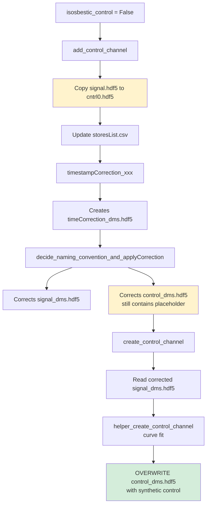
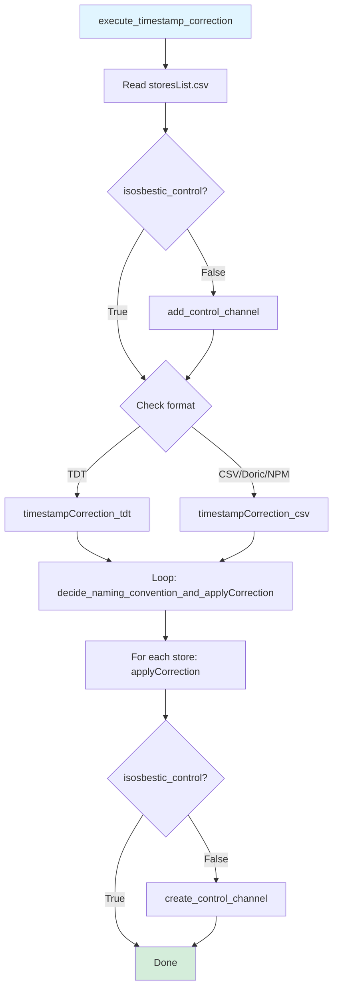
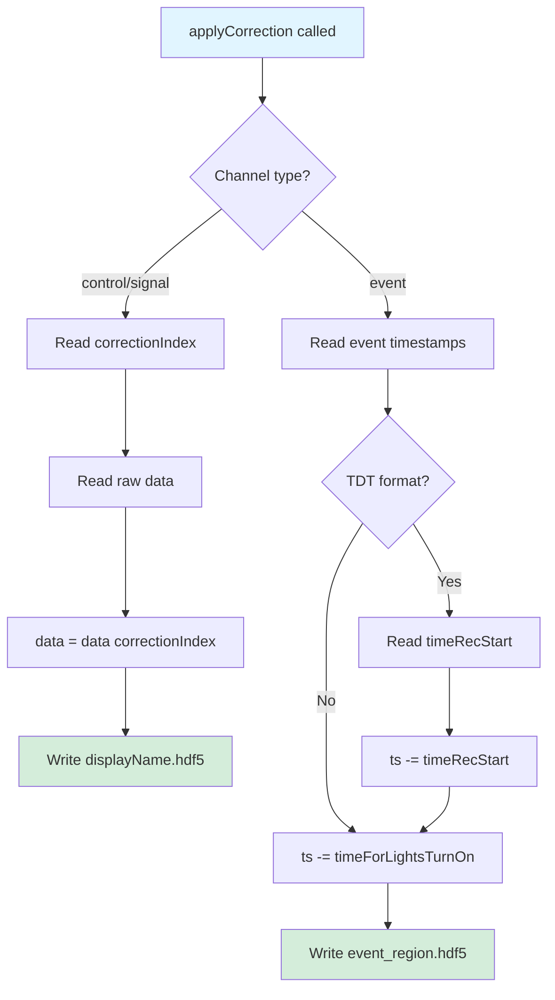

# Timestamp Correction Module Analysis

## Overview

The `timestamp_correction.py` module handles the correction of timestamps for photometry data, including:
- Eliminating the first N seconds of recording (light stabilization period)
- Expanding TDT block timestamps into continuous timestamps
- Creating synthetic control channels when no isosbestic control is present
- Applying corrections to both data channels and event markers

## Module Structure

### Entry Point from preprocess.py

```python
execute_timestamp_correction(folderNames, inputParameters)  # preprocess.py:212
```

This orchestrator loops through all session folders and calls functions in this module.

## Two-Phase Control Channel Creation Pattern

### Understanding add_control_channel vs create_control_channel

These two functions work together in a **two-phase process** to handle synthetic control channel generation. They are **not redundant** but serve distinct purposes:

#### Phase 1: `add_control_channel` (Called BEFORE timestamp correction)

**Execution:** Line 229 in `execute_timestamp_correction`

**Purpose:** Create **PLACEHOLDER** control files to satisfy workflow requirements

**What it does:**
1. Validates that if `isosbestic_control=False`, no real control channels exist
2. For each signal channel without a matching control:
   - Copies the raw signal HDF5 file to `cntrl{i}.hdf5` (placeholder)
   - Adds entry to storesList: `[["cntrl{i}"], ["control_{region}"]]`
3. Saves updated `storesList.csv`

**Files created:**
- `cntrl0.hdf5`, `cntrl1.hdf5`, etc. (copies of **RAW** signal data)
- Updated `storesList.csv` with placeholder entries

**Why it's needed:**
- Timestamp correction workflow expects **paired** control/signal channels in storesList
- Without placeholders, the pairing logic in `timestampCorrection_xxx` and `check_cntrl_sig_length` would fail
- The placeholder **data is never actually used** - it just satisfies structural requirements

#### Phase 2: `create_control_channel` (Called AFTER timestamp correction)

**Execution:** Line 243 in `execute_timestamp_correction`

**Purpose:** Generate **ACTUAL** synthetic control via curve fitting and overwrite placeholders

**What it does:**
1. Looks for placeholder files (checks: `"control" in event_name.lower() and "cntrl" in event.lower()`)
2. Reads the **CORRECTED** signal data: `signal_{region}.hdf5` (after timestamp correction)
3. Calls `helper_create_control_channel()` to:
   - Apply Savitzky-Golay filter to cleaned signal
   - Fit to exponential function: `f(x) = a + b * exp(-(1/c) * x)`
4. **OVERWRITES** the placeholder `control_{region}.hdf5` with real synthetic control
5. Also exports to CSV format (legacy)

**Files written:**
- `control_{region}.hdf5` → `data` (replaces placeholder with curve-fitted control)
- `{raw_name}.csv` (timestamps, data, sampling_rate columns)

**Why it's separate:**
- Requires **timestamp-corrected** signal data (doesn't exist until after lines 232-239)
- Curve fitting algorithm needs clean timestamps (first N seconds eliminated)
- Cannot be done before timestamp correction without re-correcting the synthetic control

#### Execution Timeline

```python
# When isosbestic_control == False:

# ========== PHASE 1: BEFORE TIMESTAMP CORRECTION ==========
# Line 229: Create placeholders (just file copies)
storesList = add_control_channel(filepath, storesList)
# Result: storesList now has paired structure
#   [["Dv1A", "cntrl0"], ["signal_dms", "control_dms"]]
# Files: cntrl0.hdf5 (copy of raw signal, never used)

# ========== TIMESTAMP CORRECTION PHASE ==========
# Lines 232-234: Process both signal AND placeholder control
timestampCorrection_tdt(filepath, timeForLightsTurnOn, storesList)
# Result: Creates timeCorrection_dms.hdf5 with correctionIndex

# Lines 236-239: Apply corrections to all channels
decide_naming_convention_and_applyCorrection(...)
# Result: signal_dms.hdf5 now contains corrected signal data
#         control_dms.hdf5 still contains uncorrected placeholder copy

# ========== PHASE 2: AFTER TIMESTAMP CORRECTION ==========
# Line 243: Generate REAL synthetic controls
create_control_channel(filepath, storesList, window=101)
# Result: control_dms.hdf5 OVERWRITTEN with curve-fitted synthetic control
#         Now contains valid control data derived from corrected signal
```

#### Why This Design Exists

This is a **chicken-and-egg problem solved with placeholders:**

1. **Requirement:** Timestamp correction expects paired control/signal channels
2. **Constraint:** Synthetic control generation requires timestamp-corrected signal data
3. **Solution:** Create dummy placeholders → correct everything → replace placeholders with real data

#### Visual Flow



#### Refactoring Opportunity

This placeholder pattern is a **code smell** indicating potential design improvements:

**Issues:**
1. **Unnecessary I/O:** Placeholder files are written and then overwritten
2. **Confusing flow:** Hard to understand that placeholders are temporary
3. **Tight coupling:** Timestamp correction assumes paired files exist
4. **Wasted computation:** Placeholder controls get timestamp-corrected unnecessarily

**Potential Improvements:**

**Option 1: Lazy Control Creation**
- Modify timestamp correction to handle missing controls gracefully
- Only create synthetic controls after all corrections complete
- Remove placeholder file creation entirely

**Option 2: Data Structure Refactoring**
- Use a data structure that doesn't require physical paired files upfront
- Track "needs synthetic control" as metadata rather than file presence
- Generate and write controls only once at the end

**Option 3: Two-Pass Workflow**
- First pass: Correct only signal channels
- Second pass: Generate synthetic controls from corrected signals
- Would require refactoring `check_cntrl_sig_length` and pairing logic

## Function Catalog

### 1. add_control_channel
**Location:** `timestamp_correction.py:20`
**Purpose:** Create placeholder control channel files when no isosbestic control exists

```python
def add_control_channel(filepath, arr) -> arr
```

**Input:**
- `filepath`: Path to session output folder
- `arr`: 2D array `[[storenames], [storesList]]` from storesList.csv

**Process:**
1. Validates that control/signal pairs match (raises error if mismatched)
2. For each signal channel without a matching control:
   - Copies signal HDF5 file to `cntrl{i}.hdf5` (placeholder)
   - Adds entry to storesList array: `[["cntrl{i}"], ["control_{region}"]]`
3. Writes updated storesList.csv

**Output:**
- Updated `arr` with new control channel entries
- **Files Written:** Updated `storesList.csv`, copied `cntrl*.hdf5` files

**I/O Summary:**
- **Reads:** Signal HDF5 files (via shutil.copyfile)
- **Writes:** `storesList.csv`, placeholder `cntrl*.hdf5` files

---

### 2. timestampCorrection_csv
**Location:** `timestamp_correction.py:65`
**Purpose:** Correct timestamps for CSV-format data (Doric, NPM, custom CSV)

```python
def timestampCorrection_csv(filepath, timeForLightsTurnOn, storesList)
```

**Input:**
- `filepath`: Path to session output folder
- `timeForLightsTurnOn`: Seconds to eliminate from start (default: 1)
- `storesList`: 2D array `[[storenames], [storesList]]`

**Process:**
1. Filters storesList to control/signal channels only
2. Pairs control/signal channels, validates naming matches
3. Calls `check_cntrl_sig_length()` to determine which channel to use (shorter one)
4. For each control/signal pair:
   - **Reads:** `timestamps` and `sampling_rate` from raw HDF5
   - **Computes:** `correctionIndex = np.where(timestamp >= timeForLightsTurnOn)`
   - **Writes:** `timeCorrection_{region}.hdf5` with keys:
     - `timestampNew`: Corrected timestamps
     - `correctionIndex`: Indices to keep
     - `sampling_rate`: Sampling rate

**Output:**
- **Files Written:** `timeCorrection_{region}.hdf5` for each control/signal pair

**I/O Summary:**
- **Reads:** `{storename}.hdf5` → `timestamps`, `sampling_rate`
- **Writes:** `timeCorrection_{region}.hdf5` → `timestampNew`, `correctionIndex`, `sampling_rate`

---

### 3. timestampCorrection_tdt
**Location:** `timestamp_correction.py:115`
**Purpose:** Correct timestamps for TDT-format data (expands block timestamps)

```python
def timestampCorrection_tdt(filepath, timeForLightsTurnOn, storesList)
```

**Input:** Same as `timestampCorrection_csv`

**Process:**
1. Filters storesList to control/signal channels only
2. Pairs control/signal channels, validates naming matches
3. Calls `check_cntrl_sig_length()` to determine which channel to use
4. For each control/signal pair:
   - **Reads:** `timestamps`, `npoints`, `sampling_rate` from raw HDF5
   - **TDT-specific expansion algorithm:**
     ```python
     timeRecStart = timestamp[0]
     timestamps = np.subtract(timestamp, timeRecStart)  # Zero-base
     adder = np.arange(npoints) / sampling_rate         # Within-block offsets
     # Expand: for each block timestamp, add within-block offsets
     timestampNew = np.zeros((len(timestamps), lengthAdder))
     for i in range(lengthAdder):
         timestampNew[:, i] = np.add(timestamps, adder[i])
     timestampNew = (timestampNew.T).reshape(-1, order="F")  # Flatten
     correctionIndex = np.where(timestampNew >= timeForLightsTurnOn)
     timestampNew = timestampNew[correctionIndex]
     ```
   - **Writes:** `timeCorrection_{region}.hdf5` with keys:
     - `timeRecStart`: Recording start time (TDT-specific)
     - `timestampNew`: Expanded, corrected timestamps
     - `correctionIndex`: Indices to keep
     - `sampling_rate`: Sampling rate

**Output:**
- **Files Written:** `timeCorrection_{region}.hdf5` with TDT-specific `timeRecStart` key

**I/O Summary:**
- **Reads:** `{storename}.hdf5` → `timestamps`, `npoints`, `sampling_rate`
- **Writes:** `timeCorrection_{region}.hdf5` → `timeRecStart`, `timestampNew`, `correctionIndex`, `sampling_rate`

---

### 4. check_cntrl_sig_length
**Location:** `timestamp_correction.py:273`
**Purpose:** Determine which channel (control or signal) to use as reference based on length

```python
def check_cntrl_sig_length(filepath, channels_arr, storenames, storesList) -> indices
```

**Input:**
- `filepath`: Path to session output folder
- `channels_arr`: Paired control/signal array `[["control_A", "control_B"], ["signal_A", "signal_B"]]`
- `storenames`: Raw HDF5 filenames
- `storesList`: Semantic channel names

**Process:**
1. For each control/signal pair:
   - **Reads:** `data` from both control and signal HDF5
   - Compares lengths: `control.shape[0]` vs `signal.shape[0]`
   - Returns the shorter one's storename (or signal if equal)

**Output:**
- List of storenames to use for timestamp correction (one per pair)

**I/O Summary:**
- **Reads:** `{control_storename}.hdf5` → `data`, `{signal_storename}.hdf5` → `data`

**Note:** This is a pure analysis function but performs I/O to determine which data to use.

---

### 5. decide_naming_convention_and_applyCorrection
**Location:** `timestamp_correction.py:178`
**Purpose:** Loop through all channels and apply timestamp corrections

```python
def decide_naming_convention_and_applyCorrection(filepath, timeForLightsTurnOn, event, displayName, storesList)
```

**Input:**
- `filepath`: Path to session output folder
- `timeForLightsTurnOn`: Seconds eliminated from start
- `event`: Raw storename (e.g., "Dv1A")
- `displayName`: Semantic name (e.g., "control_DMS")
- `storesList`: Full storesList array

**Process:**
1. Filters storesList to control/signal channels
2. Pairs channels and validates naming conventions
3. For each pair, calls `applyCorrection(filepath, timeForLightsTurnOn, event, displayName, region)`

**Output:**
- Delegates to `applyCorrection()` (no direct I/O)

---

### 6. applyCorrection
**Location:** `timestamp_correction.py:205`
**Purpose:** Apply timestamp corrections to data channels or event markers

```python
def applyCorrection(filepath, timeForLightsTurnOn, event, displayName, naming)
```

**Input:**
- `filepath`: Path to session output folder
- `timeForLightsTurnOn`: Seconds eliminated from start
- `event`: Raw storename
- `displayName`: Semantic display name
- `naming`: Region identifier (e.g., "dms")

**Process:**

**For Control/Signal Channels:**
1. **Reads:** `timeCorrection_{naming}.hdf5` → `correctionIndex`
2. **Reads:** `{event}.hdf5` → `data`
3. **Applies:** `arr = arr[correctionIndex]` (crops data)
4. **Writes:** `{displayName}.hdf5` → `data` (overwrites with corrected data)

**For Event Channels:**
1. Detects TDT format: `check_TDT(os.path.dirname(filepath))`
2. **Reads:** `timeCorrection_{naming}.hdf5` → `timeRecStart` (if TDT)
3. **Reads:** `{event}.hdf5` → `timestamps`
4. **Applies corrections:**
   - If TDT and timestamps >= timeRecStart: subtract both `timeRecStart` and `timeForLightsTurnOn`
   - Otherwise: subtract only `timeForLightsTurnOn`
5. **Writes:** `{event}_{naming}.hdf5` → `ts` (corrected event timestamps)

**Output:**
- **Files Written:**
  - `{displayName}.hdf5` → `data` (for control/signal)
  - `{event}_{naming}.hdf5` → `ts` (for events)

**I/O Summary:**
- **Reads:** `timeCorrection_{naming}.hdf5`, `{event}.hdf5`
- **Writes:** `{displayName}.hdf5` or `{event}_{naming}.hdf5`

---

### 7. create_control_channel
**Location:** `timestamp_correction.py:247`
**Purpose:** Generate synthetic control channel using curve fitting (when no isosbestic control exists)

```python
def create_control_channel(filepath, arr, window=5001)
```

**Input:**
- `filepath`: Path to session output folder
- `arr`: storesList array `[[storenames], [storesList]]`
- `window`: Savitzky-Golay filter window (default: 5001)

**Process:**
1. Loops through storesList to find placeholder control channels (`cntrl` in storename)
2. For each placeholder:
   - **Reads:** `signal_{region}.hdf5` → `data` (corrected signal)
   - **Reads:** `timeCorrection_{region}.hdf5` → `timestampNew`, `sampling_rate`
   - **Calls:** `helper_create_control_channel(signal, timestampNew, window)` from `control_channel.py`
     - Applies Savitzky-Golay filter
     - Fits to exponential: `f(x) = a + b * exp(-(1/c) * x)`
   - **Writes:** `{control_name}.hdf5` → `data` (synthetic control)
   - **Writes:** `{event_name}.csv` with columns: `timestamps`, `data`, `sampling_rate`

**Output:**
- **Files Written:**
  - `control_{region}.hdf5` → `data` (replaces placeholder)
  - `{raw_name}.csv` (legacy format export)

**I/O Summary:**
- **Reads:** `signal_{region}.hdf5` → `data`, `timeCorrection_{region}.hdf5` → `timestampNew`, `sampling_rate`
- **Writes:** `control_{region}.hdf5` → `data`, `{raw_name}.csv`

---

## Data Flow Diagram

### High-Level Flow (called from execute_timestamp_correction)



### Detailed Flow: timestampCorrection Functions

```mermaid
flowchart LR
    A[Raw HDF5 files] --> B[check_cntrl_sig_length]
    B --> C[Read control & signal data]
    C --> D[Return shorter channel name]

    D --> E{Format?}
    E -->|CSV| F[timestampCorrection_csv]
    E -->|TDT| G[timestampCorrection_tdt]

    F --> H[Read timestamps from selected channel]
    G --> I[Read timestamps, npoints, sampling_rate]

    H --> J[correctionIndex = where >= timeForLightsTurnOn]
    I --> K[Expand block timestamps]
    K --> J

    J --> L[Write timeCorrection_{region}.hdf5]

    style A fill:#e1f5ff
    style L fill:#d4edda
```

### Detailed Flow: applyCorrection



### Detailed Flow: Control Channel Creation

```mermaid
flowchart LR
    A[add_control_channel] --> B[For each signal without control]
    B --> C[Copy signal.hdf5 to cntrl_i.hdf5]
    C --> D[Update storesList.csv]

    D --> E[... timestamp correction ...]

    E --> F[create_control_channel]
    F --> G[For each cntrl_i placeholder]
    G --> H[Read signal_{region}.hdf5]
    H --> I[helper_create_control_channel]
    I --> J[Savitzky-Golay filter]
    J --> K[Curve fit to exponential]
    K --> L[Write control_{region}.hdf5]
    L --> M[Export to CSV]

    style A fill:#fff3cd
    style M fill:#d4edda
```

## Execution Order in execute_timestamp_correction

```python
# preprocess.py:212-247
for each session in folderNames:
    for each output_folder in session:
        # Step 1: Read metadata
        storesList = np.genfromtxt("storesList.csv")

        # Step 2: Add placeholder controls if needed
        if isosbestic_control == False:
            storesList = add_control_channel(filepath, storesList)

        # Step 3: Compute correctionIndex and timestampNew
        if check_TDT(folderName):
            timestampCorrection_tdt(filepath, timeForLightsTurnOn, storesList)
        else:
            timestampCorrection_csv(filepath, timeForLightsTurnOn, storesList)

        # Step 4: Apply corrections to all channels/events
        for each store in storesList:
            decide_naming_convention_and_applyCorrection(
                filepath, timeForLightsTurnOn, storename, displayName, storesList
            )
            # ^ This calls applyCorrection for each channel

        # Step 5: Generate synthetic controls via curve fitting
        if isosbestic_control == False:
            create_control_channel(filepath, storesList, window=101)
```

## File I/O Summary

### Files Read

| Function | Files Read | Keys |
|----------|-----------|------|
| `add_control_channel` | `signal_*.hdf5` (for copying) | - |
| `timestampCorrection_csv` | `{storename}.hdf5` | `timestamps`, `sampling_rate` |
| `timestampCorrection_tdt` | `{storename}.hdf5` | `timestamps`, `npoints`, `sampling_rate` |
| `check_cntrl_sig_length` | `control_*.hdf5`, `signal_*.hdf5` | `data` |
| `applyCorrection` | `timeCorrection_{region}.hdf5`<br>`{event}.hdf5` | `correctionIndex`, `timeRecStart` (TDT)<br>`data` or `timestamps` |
| `create_control_channel` | `signal_{region}.hdf5`<br>`timeCorrection_{region}.hdf5` | `data`<br>`timestampNew`, `sampling_rate` |

### Files Written

| Function | Files Written | Keys | Notes |
|----------|--------------|------|-------|
| `add_control_channel` | `storesList.csv`<br>`cntrl{i}.hdf5` | -<br>(copy of signal) | Placeholder files |
| `timestampCorrection_csv` | `timeCorrection_{region}.hdf5` | `timestampNew`, `correctionIndex`, `sampling_rate` | One per region |
| `timestampCorrection_tdt` | `timeCorrection_{region}.hdf5` | `timeRecStart`, `timestampNew`, `correctionIndex`, `sampling_rate` | TDT-specific |
| `applyCorrection` | `{displayName}.hdf5`<br>`{event}_{region}.hdf5` | `data`<br>`ts` | Overwrites with corrected data |
| `create_control_channel` | `control_{region}.hdf5`<br>`{raw_name}.csv` | `data`<br>timestamps, data, sampling_rate | Replaces placeholder |

## Key Transformations

### 1. Timestamp Expansion (TDT only)

**Input:** Block timestamps (one per acquisition block)
**Algorithm:**
```python
timeRecStart = timestamp[0]
timestamps = timestamp - timeRecStart  # Zero-base
adder = np.arange(npoints) / sampling_rate  # Within-block offsets [0, 1/fs, 2/fs, ...]
# Matrix multiplication to expand:
timestampNew = zeros((n_blocks, npoints))
for i in range(npoints):
    timestampNew[:, i] = timestamps + adder[i]
timestampNew = timestampNew.T.reshape(-1, order='F')  # Column-major flatten
```
**Output:** Continuous timestamps at full sampling rate

### 2. Correction Index Computation

**Input:** Timestamps array, `timeForLightsTurnOn`
**Algorithm:**
```python
correctionIndex = np.where(timestamp >= timeForLightsTurnOn)[0]
```
**Output:** Indices of timestamps to keep (after eliminating first N seconds)

### 3. Data Cropping

**Applied to:** Control/signal data channels
**Algorithm:**
```python
data_corrected = data[correctionIndex]
```

### 4. Event Timestamp Adjustment

**Applied to:** Event markers (TTL pulses)
**Algorithm:**
```python
# CSV format:
ts_corrected = ts - timeForLightsTurnOn

# TDT format (if ts >= timeRecStart):
ts_corrected = ts - timeRecStart - timeForLightsTurnOn
```

### 5. Synthetic Control Generation

**Input:** Signal channel (already corrected)
**Algorithm:**
1. Apply Savitzky-Golay filter: `filtered_signal = savgol_filter(signal, window, polyorder=3)`
2. Curve fit to exponential: `control = a + b * exp(-(1/c) * t)`
3. Return fitted curve as synthetic control

## Analysis for I/O Separation

### Pure Analysis Functions (Minimal I/O)
These could be extracted with I/O injected:
- ❌ None - all functions perform substantial I/O

### Orchestration Functions (Heavy I/O, Light Analysis)
These coordinate reading/writing and delegate computation:
- `add_control_channel` - File copying and CSV writing
- `decide_naming_convention_and_applyCorrection` - Loops and delegates
- `create_control_channel` - Orchestrates read → process → write

### Mixed Functions (I/O + Analysis)
These perform both I/O and computation inline:
- `timestampCorrection_csv` - Reads data, computes correctionIndex, writes results
- `timestampCorrection_tdt` - Reads data, expands timestamps, computes correctionIndex, writes
- `applyCorrection` - Reads multiple files, applies transformations, writes
- `check_cntrl_sig_length` - Reads data just to compare lengths

## Refactoring Recommendations for I/O Separation

### Option 1: Extract Pure Computation Functions

Create new pure functions:
```python
# Pure analysis (no I/O)
def compute_correction_index(timestamps, timeForLightsTurnOn):
    return np.where(timestamps >= timeForLightsTurnOn)[0]

def expand_tdt_timestamps(block_timestamps, npoints, sampling_rate):
    # TDT expansion algorithm
    ...
    return expanded_timestamps

def crop_data_by_index(data, correctionIndex):
    return data[correctionIndex]

def adjust_event_timestamps(ts, timeRecStart, timeForLightsTurnOn, is_tdt):
    # Event adjustment logic
    ...
    return adjusted_ts
```

Then modify existing functions to use these pure functions, keeping I/O separate.

### Option 2: Reader/Writer Pattern

Create dedicated I/O classes:
```python
class TimestampCorrectionReader:
    def read_raw_timestamps(self, filepath, storename):
        ...

    def read_correction_data(self, filepath, region):
        ...

class TimestampCorrectionWriter:
    def write_correction_file(self, filepath, region, data):
        ...

    def write_corrected_data(self, filepath, displayName, data):
        ...
```

### Option 3: Data Class Pattern

Return data objects instead of writing directly:
```python
@dataclass
class TimestampCorrection:
    timestampNew: np.ndarray
    correctionIndex: np.ndarray
    sampling_rate: float
    timeRecStart: Optional[float] = None  # TDT only

def timestampCorrection_tdt(...) -> TimestampCorrection:
    # Compute all values
    return TimestampCorrection(
        timestampNew=...,
        correctionIndex=...,
        sampling_rate=...,
        timeRecStart=...
    )

# Separate writer function
def write_timestamp_correction(filepath, region, correction: TimestampCorrection):
    write_hdf5(correction.timestampNew, f"timeCorrection_{region}", filepath, "timestampNew")
    # ... etc
```

## Current I/O Patterns to Refactor

1. **Inline writes in computation functions:**
   - `timestampCorrection_csv` and `timestampCorrection_tdt` compute AND write
   - Should separate: compute → return data → write in caller

2. **Reading for validation only:**
   - `check_cntrl_sig_length` reads full data arrays just to compare shapes
   - Could be optimized to read only array metadata/shapes

3. **Side-effect file creation:**
   - `add_control_channel` creates files as side effect
   - `create_control_channel` both generates data AND writes multiple formats (HDF5 + CSV)

4. **Mixed responsibilities in applyCorrection:**
   - Handles both control/signal cropping AND event timestamp adjustment
   - Could be split into two separate functions
